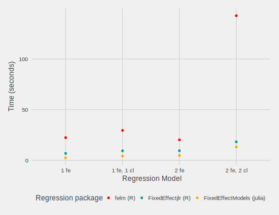
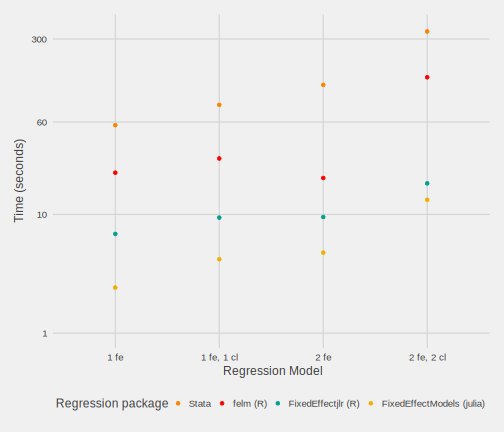

### Simple benchmark 




Code to reproduce this graph:

In Julia:

  ```julia
  using DataFrames, FixedEffectModels
  N = 10000000
  K = 100
  id1 = rand(1:(N/K), N)
  id2 = rand(1:K, N)
  x1 =  randn(N)
  x2 =  randn(N)
  
  
@time reg(df, 
	@model(y ~ x1 + x2, fe = id1) )
@time reg(df, 
	@model(y ~ x1 + x2, fe = id1, vcov = cluster(id1) ) )
@time reg(df, 
	@model(y ~ x1 + x2, fe = id1 + id2 ) )
@time reg(df, 
	@model(y ~ x1 + x2, fe = id1 + id2, vcov = cluster(id1 + id2) ) )
```

In R 

```r
N = 1e7
K = 1e2
df = data.frame(
  id1 =  as.factor(sample(N/K, N, replace = TRUE)),
  id2 =  as.factor(sample(K, N, replace = TRUE)),
  y =  runif(N),
  x1 =  runif(N),
  x2 =  runif(N)
)
```

First using `felm`:

```r
felm(y ~ x1 + x2|id1, df)
felm(y ~ x1 + x2|id1|0|id1, df)
felm(y ~ x1 + x2|(id1 + id2), df)
felm(y ~ x1 + x2|(id1 + id2)|0|id1+id2, df)
```

Then using `glmhdfe`

```r
glmhdfe(y ~ x1 + x2|id1, df)
glmhdfe(y ~ x1 + x2|id1|0|id1, df)
glmhdfe(y ~ x1 + x2|(id1 + id2), df)
glmhdfe(y ~ x1 + x2|(id1 + id2)|0|id1+id2, df)
```

And using `FixedEffedtjlr`

```r
FixedEffect(df, lhs = "y", rhs = "x1 + x2",
            fe = "id1", vcov = "robust")

FixedEffect(df, lhs = "y", rhs = "x1 + x2",
            fe = "id1", vcov = "cluster(id1)")

FixedEffect(df, lhs = "y", rhs = "x1 + x2",
            fe = "id1 + id2", vcov = "robust")
    
FixedEffect(df, lhs = "y", rhs = "x1 + x2",
            fe = "id1 + id2", vcov = "cluster(id1 + id2)")
```


Matthieu uses the following code in Stata:
```
clear all
local N = 10000000
local K = 100
set obs `N'
gen  id1 =  floor(runiform() * (`N'+1)/`K')
gen  id2 =  floor(runiform() * (`K'+1))
gen   y =  runiform()
gen   x1 =  runiform()
gen   x2 =  runiform()
timer clear

set rmsg on

areg y x1 x2, a(id1)
areg y x1 x2, a(id1) cl(id1)
reghdfe y x1 x2, a(id1 id2) fast keepsingletons
reghdfe y x1 x2, a(id1 id2) cl(id1 id2) fast keepsingletons
```

Benchmark including stata with log scale


